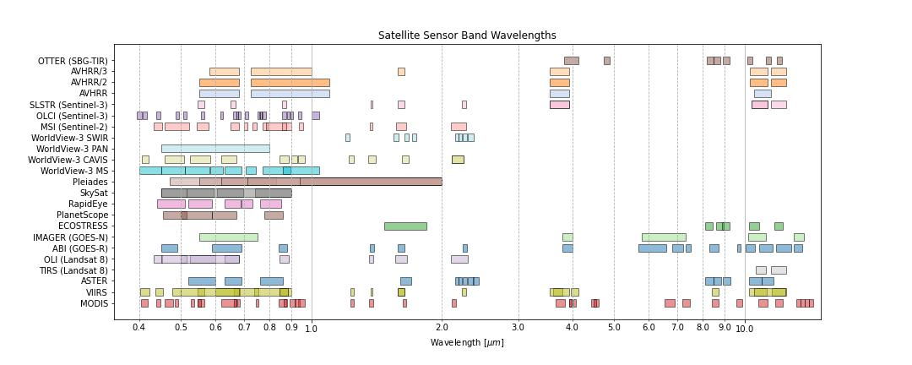

# Satellite Sensor Bands in the Visible to Infrared

[satellite_sensor_bands.csv](satellite_sensor_bands.csv) contains various visible and infrared remote sensing instruments and the spectral bands they cover. (wavelength units in μm, spatial resolution at nadir units in m)

*Note: This information was compiled for my own reference from various sources (such as the very helpful [WMO Observing Systems Capability Analysis and Review Tool](https://space.oscar.wmo.int/)), and I can't guarantee that it is all completely accurate or up to date. For example, I have chosen to include the 30 m ASTER SWIR bands although they are no longer operational. Please submit a pull request or contact me to make any corrections/additions. Thanks!*

Resources in the [pyspectral](https://pyspectral.readthedocs.io/en/master/index.html) library may also be of interest, such as the [spectral response curves](https://pyspectral.readthedocs.io/en/master/platforms_supported.html) of various satellite sensors. The [RTTOV documentation](https://nwp-saf.eumetsat.int/site/software/rttov/download/coefficients/spectral-response-functions/) is also an excellent resource for spectral response functions.
